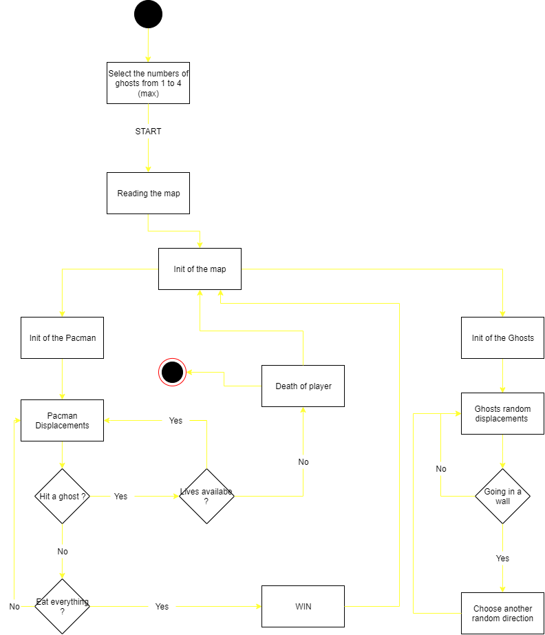
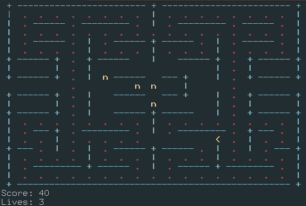

 ARCHITECTURE - Documentation 
======================

This document will allow you to understand the developement and the decisions we made for this project, as well as the architecture of the project. 

 Project Structure : 
----------------------

We decided to split the project into several code files in order to have a better vision of the project in its entirety as well as to have a better organization.
We put all the images and documentation in the Documentation folder.

###  Scripts 
- main.go : This script is the center of our program. It links the different scripts and functions together in order to have a functional program. It also defines the basic structures and parameters of our ghosts and our pacman. It also allows to edit the matrix that manages our map. (threads are defined in it)
- playerMovement.go : Allows to manage the movements of the Pacman, to recover the keys typed by the user in order to transcribe them in the game to direct the character. 
- ghost.go : handles everything related to moving ghosts.
- read.go : This script makes it possible to recover data from map.txt and transcribe them into a matrix which will then be used throughout the project.
- print.go : This script displays the map, the score, the number of lives remaining of the game from the matrix.

###  Documentation 
- img : Folder that groups the photos used.
- ARCHITECTURE.md : Documentation which allows to understand the architecture of the code as well as the development of our project.
- PACMAN.md : Documentation that helps to understand how to build and run our project.

###  Maps 
- maps.txt : Corresponds to the different maps of our game.

###  External scripts 
- go.mod
- go.sum : scripts to integrate the github library into our project

  Structure of types 
------------

Pacman:
- x,y int : corresponds to the position of the pacman. Starts at {9,15}
- lives int : corresponds to the number of lives remaining in the pacman. Starts at 3
- dir string : Corresponds to the current direction of the pacman. Start to the right
- changed bool : Allows to check if pacman does not hit a wall, starts at False.
- coins int : Corresponds to the number of coins remaining on the map, starts with the value retrieved by read.go

Ghost:
- x,y int : corresponds to the position of the ghost. Redifined in Game
- past int : corresponds to the previous position of the ghost
- changed bool : Allows to check if the ghost does not hit a wall, starts at False.

Game:
- pac Pacman : corresponds to a pacman object
- ghosts []Ghost : corresponds to a list of ghosts (from 1 to 4, defined at the beginning)
- maps [399]int : corresponds to the map retrieved in read.go
- score int : corresponds to the score of the pacman, starts at 0.

  Activity Diagram : 
------------

  Activity Diagram : 
------------

Pacman |
----- |
type Pacman struct {x,y,lives,dir,changed} |
type Ghost struct {x,y,past,changed] |
type Game struct {pac,ghosts,maps,score} |
|
 test |
func moveGhosts(game *Game); |
func findDirection() string;
func Move(dir string, ghost *Ghost, game *Game) (newRow, newCol int); |
func readInput() (string, error); |
func makeMove(game *Game); |
func printMap(g *Game); |
func readMap(file string, map_ [399]int) ([399]int, error); |

 Graphic Interface : 
-------------------

For the graphical interface we just plan to use the console and create an ASCII graphical interface.
In order to have a better representation of the map and the game for the user, we will use a color system to differentiate the walls, the Pacman, the ghosts and the points.
- The Pacman will be represented with the following characters :  <  *(going to the right)*     >  *(going to the left)*    v  *(going up)*      ^  *(going down)* and will be in yellow.
- The ghosts will be represented with the following character :  n    and will be in different color (not yellow)
- The walls will be represented ...
- The points will be represented by classic points :  . 

 Map Management : 
----------------
  

↑
Corresponds to the our interface

{{2,2,2,2,2,2,2,2,2,2,2,2,2,2,2,2,2,2,2},  
&nbsp;{2,1,1,1,1,1,1,1,1,2,1,1,1,1,1,1,1,1,2},  
&nbsp;{2,1,2,2,1,2,2,2,1,2,1,2,2,2,1,2,2,1,2},  
&nbsp;{2,1,1,1,1,1,1,1,1,1,1,1,1,1,1,1,1,1,2},  
&nbsp;{2,1,2,2,1,2,1,2,2,2,2,2,1,2,1,2,2,1,2},  
&nbsp;{2,1,1,1,1,2,1,1,1,2,1,1,1,2,1,1,1,1,2},  
&nbsp;{2,2,2,2,1,2,2,2,0,2,0,2,2,2,1,2,2,2,2},  
&nbsp;{2,2,2,2,1,2,0,0,0,0,0,0,0,2,1,2,2,2,2},  
&nbsp;{2,2,2,2,1,2,0,2,2,0,2,2,0,2,1,2,2,2,2},  
&nbsp;{0,0,0,0,1,0,0,2,0,0,0,2,0,0,1,0,0,0,0},  
&nbsp;{2,2,2,2,1,2,0,2,2,2,2,2,0,2,1,2,2,2,2},  
&nbsp;{2,2,2,2,1,2,0,0,0,0,0,0,0,2,1,2,2,2,2},  
&nbsp;{2,2,2,2,1,2,0,2,2,2,2,2,0,2,1,2,2,2,2},  
&nbsp;{2,1,1,1,1,1,1,1,1,2,1,1,1,1,1,1,1,1,2},  
&nbsp;{2,1,2,2,1,2,2,2,1,2,1,2,2,2,1,2,2,1,2},  
&nbsp;{2,1,1,2,1,1,1,1,1,1,1,1,1,1,1,2,1,1,2},  
&nbsp;{2,2,1,2,1,2,1,2,2,2,2,2,1,2,1,2,1,2,2},  
&nbsp;{2,1,1,1,1,2,1,1,1,2,1,1,1,2,1,1,1,1,2},  
&nbsp;{2,1,2,2,2,2,2,2,1,2,1,2,2,2,2,2,2,1,2},  
&nbsp;{2,1,1,1,1,1,1,1,1,1,1,1,1,1,1,1,1,1,2},  
&nbsp;{2,2,2,2,2,2,2,2,2,2,2,2,2,2,2,2,2,2,2}}

↑
Corresponds to the [map.txt](../map.txt)

Regarding the management of the map, we decided to represent it in the form of a matrix, as can be seen in the images above.
We define each box with a specific value to define its state : 

- 0 corresponds to a box already eaten
- 1 corresponds to a box not yet eaten
- 2 corresponds to a wall
- 3 corresponds to the Pacman
- 4 corresponds to the ghosts
