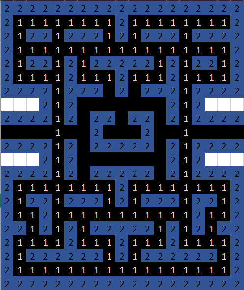
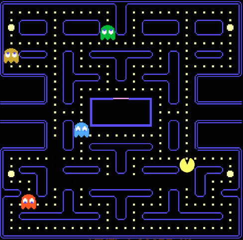

ARCHITECTURE - Documentation
======================

This document will allow you to understand the developement and the decisions we made for this project, as well as the architecture of the project. 

Project Architecture :
----------------------

We decided to split the project into several code files in order to have a better vision of the project in its entirety as well as to have a better organization.
We put all the supporting scripts in the src folder and left main.c in the global folder. As well as images and documentation in the Documentation folder.

### Scripts
- main.c : This script is the center of our program. It links the different scripts and functions together in order to have a functional program. It also defines the basic structures and parameters of our ghosts and our pacman. It also allows to edit the matrix that manages our map.
- movement.c : Allows to manage the movements of the Pacman, to recover the keys typed by the user in order to transcribe them in the game to direct the character.
- ghost.c : Allows you to define the structure of ghosts. This also governs their random movement.
- read.c : This script makes it possible to recover data from map.txt and transcribe them into a matrix which will then be used throughout the project.
- print.c : This script displays the map and the score of the game from the matrix.

### Documentation
- img : Folder that groups the photos used.
- ARCHITECTURE.md : Documentation which allows to understand the architecture of the code as well as the development of our project.
- PACMAN.md : Documentation that helps to understand how to build and run our project.

### Maps
- maps.txt : Corresponds to the different maps of our game.

### External scripts
- conio.h 
- conio.c : Use to import the conio library which is normally reserved for windows users. This library makes it possible to detect the pressure of the keys to manage the movements.

Graphic Interface :
-------------------

For the graphical interface we just plan to use the console and create an ASCII graphical interface.
In order to have a better representation of the map and the game for the user, we will use a color system to differentiate the walls, the Pacman, the ghosts and the points.
- The Pacman will be represented with the following characters : **<** *(going to the right)*    **>** *(going to the left)*    **v** *(going up)*     **^** *(going down)* and will be in yellow.
- The ghosts will be represented with the following character : n   and will be in different color (not yellow)
- The walls will be represented ...
- The points will be represented ... 

Map Management :
----------------
  
  
{{2,2,2,2,2,2,2,2,2,2,2,2,2,2,2,2,2,2,2},  
&nbsp;{2,1,1,1,1,1,1,1,1,2,1,1,1,1,1,1,1,1,2},  
&nbsp;{2,1,2,2,1,2,2,2,1,2,1,2,2,2,1,2,2,1,2},  
&nbsp;{2,1,1,1,1,1,1,1,1,1,1,1,1,1,1,1,1,1,2},  
&nbsp;{2,1,2,2,1,2,1,2,2,2,2,2,1,2,1,2,2,1,2},  
&nbsp;{2,1,1,1,1,2,1,1,1,2,1,1,1,2,1,1,1,1,2},  
&nbsp;{2,2,2,2,1,2,2,2,0,2,0,2,2,2,1,2,2,2,2},  
&nbsp;{2,2,2,2,1,2,0,0,0,0,0,0,0,2,1,2,2,2,2},  
&nbsp;{2,2,2,2,1,2,0,2,2,0,2,2,0,2,1,2,2,2,2},  
&nbsp;{0,0,0,0,1,0,0,2,0,0,0,2,0,0,1,0,0,0,0},  
&nbsp;{2,2,2,2,1,2,0,2,2,2,2,2,0,2,1,2,2,2,2},  
&nbsp;{2,2,2,2,1,2,0,0,0,0,0,0,0,2,1,2,2,2,2},  
&nbsp;{2,2,2,2,1,2,0,2,2,2,2,2,0,2,1,2,2,2,2},  
&nbsp;{2,1,1,1,1,1,1,1,1,2,1,1,1,1,1,1,1,1,2},  
&nbsp;{2,1,2,2,1,2,2,2,1,2,1,2,2,2,1,2,2,1,2},  
&nbsp;{2,1,1,2,1,1,1,1,1,1,1,1,1,1,1,2,1,1,2},  
&nbsp;{2,2,1,2,1,2,1,2,2,2,2,2,1,2,1,2,1,2,2},  
&nbsp;{2,1,1,1,1,2,1,1,1,2,1,1,1,2,1,1,1,1,2},  
&nbsp;{2,1,2,2,2,2,2,2,1,2,1,2,2,2,2,2,2,1,2},  
&nbsp;{2,1,1,1,1,1,1,1,1,1,1,1,1,1,1,1,1,1,2},  
&nbsp;{2,2,2,2,2,2,2,2,2,2,2,2,2,2,2,2,2,2,2}}

 &nbsp; &nbsp; &nbsp; &nbsp; &nbsp; &nbsp; &nbsp; &nbsp;  &nbsp; &nbsp; &nbsp; &nbsp; &nbsp; &nbsp; &nbsp; &nbsp; 

Regarding the management of the map, we decided to represent it in the form of a matrix, as can be seen in the images above.
We define each box with a specific value to define its state : 

- 0 corresponds to a box already eaten
- 1 corresponds to a box not yet eaten
- 2 corresponds to a wall
- 3 corresponds to the Pacman
- 4 corresponds to the ghosts

Ghosts
------

Regarding how ghosts work, we decided to make them follow a random path. 
On each tick they will move in a random direction and wait for the next tick. Obviously, they cannot cross the walls and removes a life from the Pacman if they cross paths.
