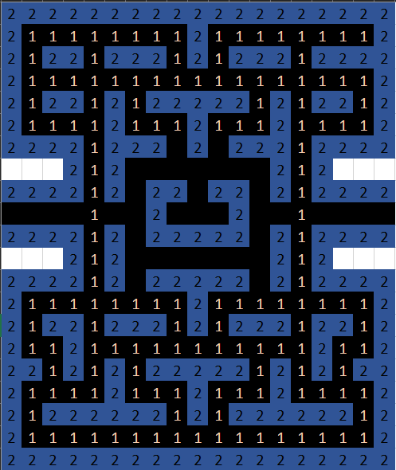
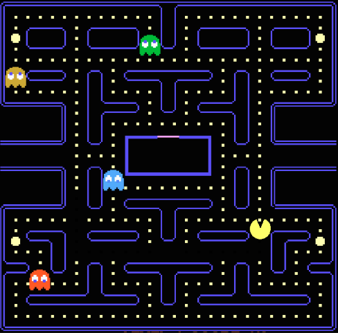

PACMAN - Documentation
======================

This document will allow you to understand the developement and the decisions we made for this project.

Graphic Interface :
-------------------

For the graphical interface we just plan to use the console and create an ASCII graphical interface.
In order to have a better representation of the map and the game for the user, we will use a color system to differentiate the walls, the Pacman, the ghosts and the points.
- The Pacman will be represented with the following characters : **<** *(going to the right)*    **>** *(going to the left)*    **v** *(going up)*     **^** *(going down)* and will be in yellow.
- The ghosts will be represented with the following character : n   and will be in different color (not yellow)
- The walls will be represented ...
- The points will be represented ... 

Map Management :
----------------
  
  
{{2,2,2,2,2,2,2,2,2,2,2,2,2,2,2,2,2,2,2},  
&nbsp;{2,1,1,1,1,1,1,1,1,2,1,1,1,1,1,1,1,1,2},  
&nbsp;{2,1,2,2,1,2,2,2,1,2,1,2,2,2,1,2,2,1,2},  
&nbsp;{2,1,1,1,1,1,1,1,1,1,1,1,1,1,1,1,1,1,2},  
&nbsp;{2,1,2,2,1,2,1,2,2,2,2,2,1,2,1,2,2,1,2},  
&nbsp;{2,1,1,1,1,2,1,1,1,2,1,1,1,2,1,1,1,1,2},  
&nbsp;{2,2,2,2,1,2,2,2,0,2,0,2,2,2,1,2,2,2,2},  
&nbsp;{2,2,2,2,1,2,0,0,0,0,0,0,0,2,1,2,2,2,2},  
&nbsp;{2,2,2,2,1,2,0,2,2,0,2,2,0,2,1,2,2,2,2},  
&nbsp;{0,0,0,0,1,0,0,2,0,0,0,2,0,0,1,0,0,0,0},  
&nbsp;{2,2,2,2,1,2,0,2,2,2,2,2,0,2,1,2,2,2,2},  
&nbsp;{2,2,2,2,1,2,0,0,0,0,0,0,0,2,1,2,2,2,2},  
&nbsp;{2,2,2,2,1,2,0,2,2,2,2,2,0,2,1,2,2,2,2},  
&nbsp;{2,1,1,1,1,1,1,1,1,2,1,1,1,1,1,1,1,1,2},  
&nbsp;{2,1,2,2,1,2,2,2,1,2,1,2,2,2,1,2,2,1,2},  
&nbsp;{2,1,1,2,1,1,1,1,1,1,1,1,1,1,1,2,1,1,2},  
&nbsp;{2,2,1,2,1,2,1,2,2,2,2,2,1,2,1,2,1,2,2},  
&nbsp;{2,1,2,2,2,2,2,2,1,2,1,2,2,2,2,2,2,1,2},  
&nbsp;{2,1,1,1,1,1,1,1,1,1,1,1,1,1,1,1,1,1,2},  
&nbsp;{2,2,2,2,2,2,2,2,2,2,2,2,2,2,2,2,2,2,2}}

 &nbsp; &nbsp; &nbsp; &nbsp; &nbsp; &nbsp; &nbsp; &nbsp;  &nbsp; &nbsp; &nbsp; &nbsp; &nbsp; &nbsp; &nbsp; &nbsp; 

Regarding the management of the map, we decided to represent it in the form of a matrix, as can be seen in the images above.
We define each box with a specific value to define its state : 

- 0 corresponds to a box already eaten
- 1 corresponds to a box not yet eaten
- 2 corresponds to a wall

